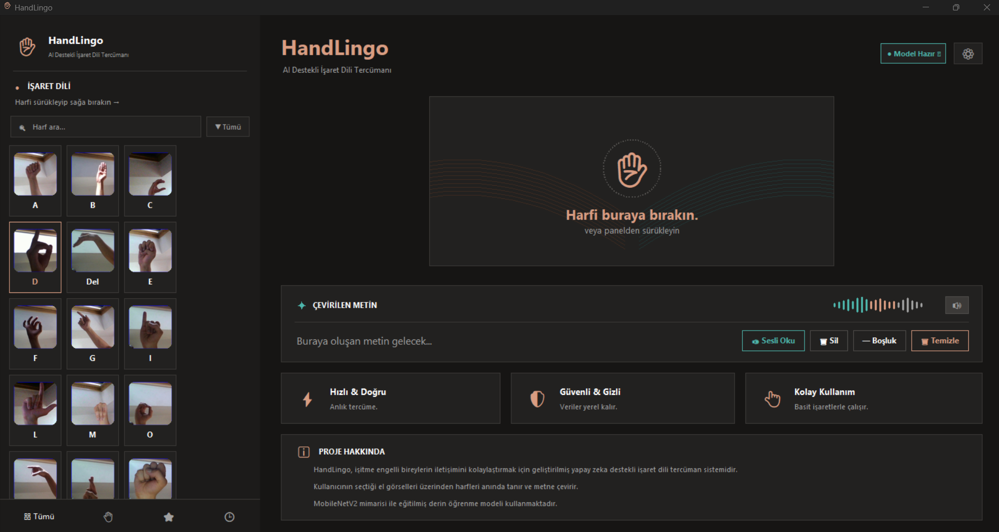
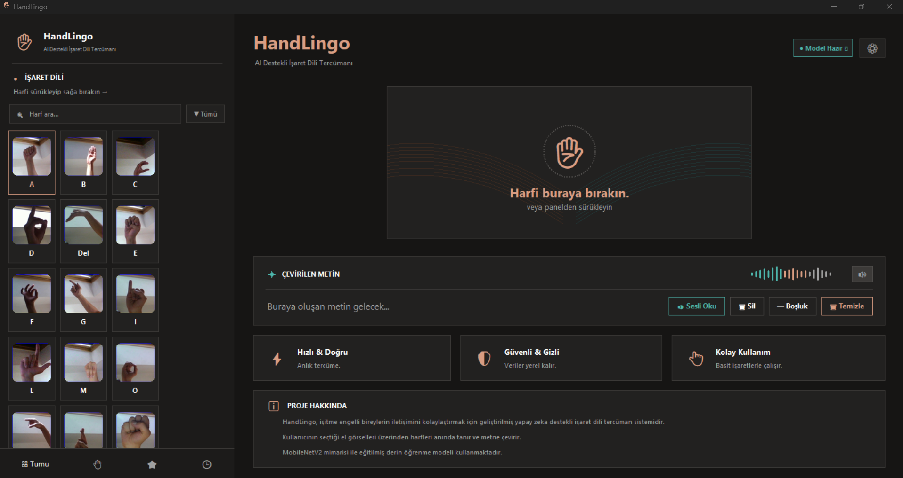
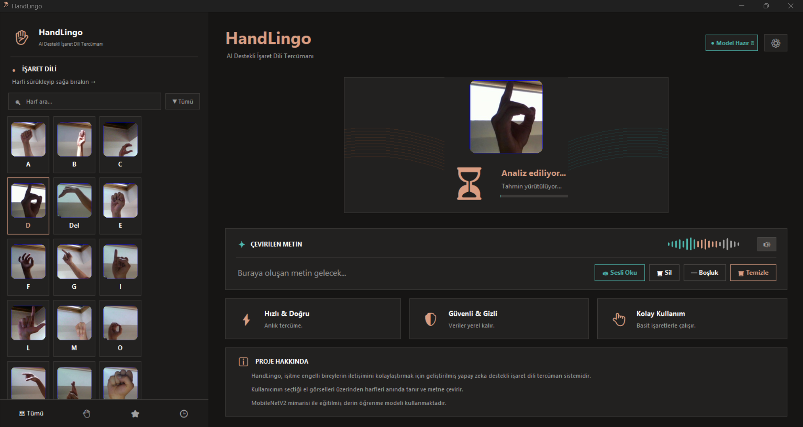
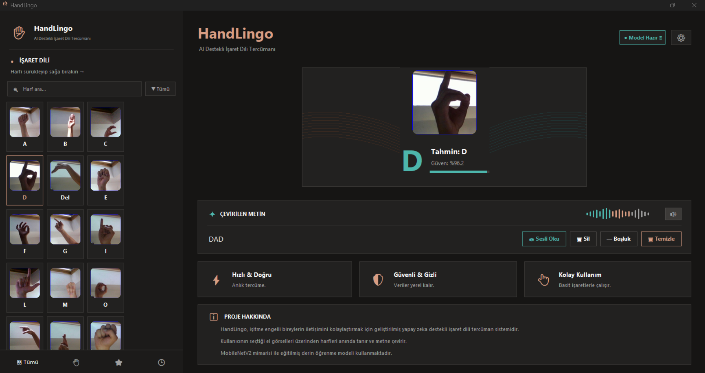

# 🤟 HandLingo — AI-Powered Sign Language Interpreter

<p align="center">
  
</p>

<p align="center">
  <strong>Bridging the communication gap between sign language users and the hearing world.</strong>
</p>

<p align="center">
  
  
  
  
  
</p>

---

## 📖 About

HandLingo is an AI-powered sign language interpretation system designed to help speech-impaired individuals communicate with those unfamiliar with sign language. The system recognizes ASL (American Sign Language) hand gestures and translates them into readable and audible text in real-time.

## ✨ Features

- 🧠 **Deep Learning Model** — MobileNetV2 with 96% accuracy
- 🖱️ **Drag & Drop Interface** — Intuitive gesture-to-text translation
- 🔊 **Text-to-Speech** — Speak the translated sentence aloud
- ⚡ **Instant Prediction** — Real-time inference with confidence scores
- 🎨 **Modern Dark UI** — Professional dashboard-style interface

## 📸 Screenshots

<p align="center">
  
</p>
<p align="center"><em>Main Interface — Drag ASL letters from left panel to predict</em></p>

<br/>

<p align="center">
  
</p>
<p align="center"><em>Prediction — AI recognizes the hand gesture with confidence score</em></p>

<br/>

<p align="center">
  
</p>
<p align="center"><em>Sentence Builder — Letters accumulate into words and sentences</em></p>

## 🏗️ Architecture

```
┌─────────────┐     ┌──────────────┐     ┌─────────────┐
│  ASL Image   │────▶│  MobileNetV2 │────▶│  Predicted   │
│  (224x224)   │     │  (PyTorch)   │     │   Letter     │
└─────────────┘     └──────────────┘     └──────┬──────┘
                                                 │
                                                 ▼
                                        ┌─────────────┐
                                        │  Sentence    │
                                        │  Builder     │
                                        │  + TTS       │
                                        └─────────────┘
```

## 📊 Model Details

| Property | Value |
|----------|-------|
| Architecture | MobileNetV2 |
| Pre-trained | ImageNet |
| Input Size | 224 × 224 px |
| Classes | 18 |
| Accuracy | 96% |
| Model Size | ~9 MB |
| Framework | PyTorch |

**Supported Letters:** A, B, C, D, Del, E, F, G, I, L, M, O, P, R, S, Space, T, Y

## 📁 Dataset

- **Source:** [Kaggle ASL Alphabet](https://www.kaggle.com/datasets/grassknoted/asl-alphabet)
- **Selected Classes:** 18
- **Images per Class:** ~3,000
- **Total Images:** ~54,000

## 🚀 Getting Started

### Prerequisites

```bash
pip install torch torchvision pillow
```

### Project Structure

```
HandLingo/
├── app_desktop.py      # Main desktop application
├── app.py              # Web version (Flask backend)
├── index.html          # Web version (frontend)
├── HandLingo.pth       # Trained model weights
├── class_names.json    # Class labels
├── config.json         # Model configuration
├── hand_hero.png       # UI asset
├── hand_lingo.jpg      # Logo
└── requirements.txt    # Dependencies
```

### Run

```bash
python app_desktop.py
```

> **Note:** Update `ASL_DIR` path in `app_desktop.py` to point to your local ASL Alphabet dataset folder.

## 🛠️ Tech Stack

- **Model Training:** PyTorch, Google Colab
- **Architecture:** MobileNetV2 (Transfer Learning)
- **Desktop App:** Tkinter, Pillow
- **Web App:** Flask, HTML/CSS/JS
- **TTS:** pyttsx3 / System Speech

## 👤 Author

**Anıl Keleş** 

## 📄 License

This project is licensed under the MIT License.

---

<p align="center">
  <strong>HandLingo</strong> — İletişimde Engel Yok, Gelecekte Engel Yok. 🤟
</p>
